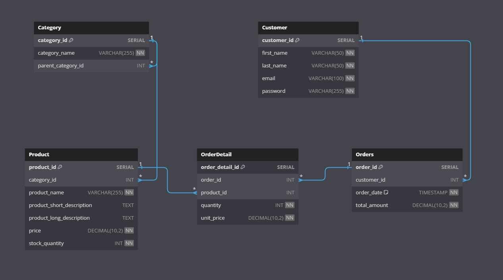

# E-Commerce Database Design

<h4> 
In the dynamic world of e-commerce, efficient database design is crucial for managing vast amounts of data and delivering seamless user experiences.
<br>

This repository contains a comprehensive database design for an e-commerce website, featuring the Entity Relationship Diagram (ERD), frequently used queries, challenges encountered, and optimizations applied while working with a large dataset of approximately 10 million rows.
</h4>

## 1. Entity Relationship Diagram (ERD)

---


you can view the database schema script [here.](resources/Schema Script.sql)

### Relationships Between Entities

- **Category** and **Product**: One-to-Many (One category can have multiple products)
- **Customer** and **Order**: One-to-Many (One customer can have multiple orders)
- **Order** and **Order_details**: One-to-Many (One order can have multiple order details)
- **Product** and **Order_details**: One-to-Many (One product can be part of multiple order details)

## 2. Denormalization technique For Performance Optimization

---
As a main feature of our website is customers being able to look at their past orders, and having hundreds of thousands of customers and millions of sales, this result could take some
time to compute.

Fortunately, the sale data is relatively static once the sale is completed so we could be able to pre-compute the result of the expensive join and save the result into a denormalized table like the one shown below.


```postgres-sql
   CREATE TABLE sale_history (
     customer_id SERIAL PRIMARY KEY,
     first_name VARCHAR(50) NOT NULL,
     last_name VARCHAR(50) NOT NULL,
     email VARCHAR(100) NOT NULL UNIQUE,
   
     product_id CHAR(8),
     product_description VARCHAR(50) NOT NULL,
     price NUMERIC(5,2) NOT NULL,
     
     sale_no SMALLINT,
     sale_date DATE NOT NULL,
     quantity INTEGER NOT NULL,
     amount NUMERIC(6,2) NOT NULL,
     
     PRIMARY KEY (sale_no)
   );
```


## 3. Category Hierarchy

---
Another problem faced while developing the system is retrieving the categories and their subcategories

One solution would be to get the subcategories dynamically whenever asked for but that could be an overhead on the database as it causes increased calls.

Another solution would be creating a denormalized category table which contains the subcategories of each category along with its other details this would allow to get all category tree in one call, greatly improving efficiency.

```postgres-sql
CREATE TABLE Category_denormalized (  
    category_id SERIAL PRIMARY KEY,  
    category_name VARCHAR(255) NOT NULL,  
    subcategories JSONB  
);
```
## 2. Frequently Used SQL Queries

---
Here we present some of the SQL queries that are essential for extracting valuable insights from our e-commerce database.
### - Daily Revenue Report

```postgres-sql
SELECT DATE(order_date) AS Order_Date ,SUM(total_amount) AS Total_Revenue
FROM Order
WHERE order_date = '2024-08-31';
GROUP BY DATE(order_date);
```

### - Monthly Top-Selling Products

```postgres-sql
SELECT p.name, SUM(od.quantity) AS Total_Quantity_Sold
FROM Product p
JOIN Order_details od ON p.product_id = od.product_id
JOIN Order o ON od.order_id = o.order_id
WHERE MONTH(o.order_date) = 8 AND YEAR(o.order_date) = 2024
GROUP BY p.name
ORDER BY Total_Quantity_Sold DESC;
```

### - Customers with Orders Over $500

```postgres-sql
SELECT c.first_name, c.last_name, SUM(o.total_amount) AS Total_Spent
FROM Customer c
JOIN Order o ON c.customer_id = o.customer_id
WHERE o.order_date >= DATEADD(MONTH, -1, GETDATE())
GROUP BY c.first_name, c.last_name
HAVING SUM(o.total_amount) > 500;
```


### - Search for all products with the word “camera” in either the product name or description:

```postgres-sql
SELECT *
FROM Product
WHERE name LIKE '%camera%'
OR description LIKE '%camera%';
```
Similar queries to this one are expected to be frequently used,
but using it in its current format is inefficient due to using the leading wildcard
which will stop the DBMS from utilizing any index on the column .

A suggested solution is using PostgreSQL `Full Text Search`,
so we would add a new calculated column and add an index on it to make the query run way faster
but trading off the storage used for the new column.


### - Suggest popular products in the same categories user bought from , excluding the purchased products:

```postgres-sql
SELECT
p.product_id,
p.name,
p.description,
p.price,
COUNT(od.product_id) AS popularity
FROM
Product p
JOIN
Order_details od ON p.product_id = od.product_id

WHERE
p.category_id IN (
                  SELECT DISTINCT category
                  FROM Products
                  WHERE product_id IN (
                                       SELECT product_id
                                       FROM Order_details
                                       WHERE customer_id = <customer id>
                                       )                    
                )
AND p.product_id NOT IN (
                           SELECT product_id
                           FROM Order_details
                           WHERE customer_id = <customer id>
                         )

GROUP BY p.product_id, p.name, p.description, p.price
ORDER BY popularity DESC
LIMIT 5;
```


## 5. Dummy Data Generation

---
To further optimize and test the performance of the queries I have used stored procedures similar to this one to populate millions of Dummy Data.

10m order detail\
1m order\
500k customer\
100k product\
10k category
```postgres-sql
CREATE OR REPLACE FUNCTION insert_fake_data(num_rows INT)
RETURNS VOID AS $$
DECLARE
    i INT;
BEGIN
    FOR i IN 1..num_rows LOOP

        INSERT INTO X (id, name, price)
        VALUES (
	    i,
            'name ' || i,
            FLOOR(1 + RANDOM() * 100)
        );
    END LOOP;
END;
$$ LANGUAGE plpgsql;
```
you can view all scripts [here](resources/Dummy Data Generator Functions.sql)

## 6. Query optimizations

---
Here we discuss the optimization of some queries after analyzing them with `Explain Analyze` and observations about the execution times before and after each optimization.
### 1. Retrieve the total number of products in each category.
   
Before optimization:
```postgres-sql
   SELECT  
   c.category_name,   
   COUNT(p.*) AS total_products  
   FROM Category c  
   LEFT JOIN Product p
   ON c.category_id = p.category_id  
   GROUP BY c.category_name
```
After optimization:
```postgres-sql
   SELECT   
      c.category_id,  
      c.category_name,   
      COUNT(p.product_id) AS total_products  
      FROM Category c  
      LEFT JOIN Product p
      ON c.category_id = p.category_id  
      GROUP BY c.category_id, c.category_name  
```
Execution time: 103ms --> 61ms

Grouping by indexed columns allows the database optimizer to use those indexes more effectively,
speeding up the aggregation process.

### 2. Find the top customers by total spending.
Before optimization:
```postgres-sql
   SELECT cu.customer_id,  
   cu.first_name,
   SUM(od.quantity * od.unit_price) AS total_spending  
   FROM Customer cu  
   JOIN Orders o ON cu.customer_id = o.customer_id  
   JOIN OrderDetail od ON o.order_id = od.order_id  
   GROUP BY cu.customer_id, cu.first_name  
   ORDER BY total_spending DESC  
   LIMIT 10;
```
Execution time: 15 secs

After optimization:
```postgres-sql
with totals as (
 	SELECT o.customer_id, SUM(OD.UNIT_PRICE * OD.QUANTITY) AS TOTAL_SPENDING
    FROM Orders o
    JOIN OrderDetail od ON o.order_id = od.order_id  
    GROUP BY o.customer_id
)

SELECT  
   cu.first_name,
   t.TOTAL_SPENDING
   FROM Customer cu  
   JOIN totals t ON cu.customer_id = t.customer_id
   ORDER BY total_spending DESC  
   LIMIT 10;
```
Execution time: 6 secs 

After further optimization:
```postgres-sql
SELECT cu.customer_id,  
   cu.first_name,
   SUM(o.total_amount) AS total_spending  
   FROM Customer cu  
   JOIN Orders o ON cu.customer_id = o.customer_id  
   GROUP BY cu.customer_id, cu.first_name  
   ORDER BY total_spending DESC  
   LIMIT 10;
```
Execution time: 1.7 sec

Using the Denormalized column orders total amount allowed us to get rid of the expensive joins making the query about 9x faster. 

### 3. Retrieve the most recent orders with customer information (for the last 1000 orders).

```postgres-sql
SELECT   
   o.order_id,  
   o.order_date,  
   cu.customer_id,  
   cu.customer_name,  
   o.total_amount  
   FROM Orders o  
   JOIN Customer cu ON o.customer_id = cu.customer_id  
   ORDER BY o.order_date DESC  
   LIMIT 1000;
```
After optimization:
```postgres-sql
CREATE INDEX order_date_idx ON Orders(order_date);

CLUSTER Orders USING ORDERS_DATE_INDEX;
```
Execution time: 500 ms --> 60ms

### 4. Calculate the revenue generated from each product category.
```postgres-sql
SELECT   
c.category_id,  
c.category_name,
SUM(od.quantity * od.unit_price) AS total_revenue  
FROM Category c  
JOIN Product p ON c.category_id = p.category_id  
JOIN OrderDetail od ON p.product_id = od.product_id    
GROUP BY c.category_id, c.category_name  
ORDER BY total_revenue DESC
```
After optimization:
```postgres-sql
CREATE MATERIALIZED VIEW category_revenue AS  
(
   SELECT   
   c.category_id,  
   c.category_name,
   SUM(od.quantity * od.unit_price) AS total_revenue  
   FROM Category c  
   JOIN Product p ON c.category_id = p.category_id  
   JOIN OrderDetail od ON p.product_id = od.product_id   
   GROUP BY c.category_id, c.category_name  
   ORDER BY total_revenue DESC
);

SELECT * FROM category_revenue;
```

Execution time: 4 secs --> ~ 0 secs

# Lessons Learned

---
Throughout the development of this e-commerce database design, several key lessons have emerged.

Firstly, the importance of `indexing` has been highlighted, significantly improving query performance.

Secondly, we learned that implementing `denormalization` where appropriate has streamlined data retrieval processes.

Additionally, the use of `materialized views` has proven to be a valuable strategy for enhancing query efficiency.

Thoughtful schema design has also been crucial for scalability, while proactive optimizations have led to dramatic improvements in performance.

The challenges we faced prompted innovative solutions that will guide our future endeavors. We hope these insights are helpful for others embarking on similar projects.

